<a href="https://www.linkedin.com/in/morgan-s-a0a8ba1b7/">
  <picture>
    <source media="(prefers-color-scheme: dark)" srcset="assets/whoami-dark.svg">
    
  </picture>
</a>

<picture>
  <source media="(prefers-color-scheme: dark)" srcset="assets/rule-dark.svg">
  
</picture>

<picture>
  <source media="(prefers-color-scheme: dark)" srcset="assets/stack-dark.svg">
  
</picture>

<picture>
  <source media="(prefers-color-scheme: dark)" srcset="assets/rule-dark.svg">
  
</picture>

<picture>
  <source media="(prefers-color-scheme: dark)" srcset="assets/statshead-dark.svg">
  
</picture>

<picture>
  <source media="(prefers-color-scheme: dark)" srcset="https://github-readme-stats.vercel.app/api?username=TeyKra&amp;show_icons=true&amp;include_all_commits=true&amp;rank_icon=github&amp;custom_title=stats&amp;card_width=467&amp;border_radius=12&amp;bg_color=0b0f14&amp;border_color=2b333d&amp;title_color=3fb950&amp;text_color=c3cedb&amp;icon_color=56d4dd&amp;ring_color=3fb950">
  
</picture>
<picture>
  <source media="(prefers-color-scheme: dark)" srcset="https://github-readme-stats.vercel.app/api/top-langs/?username=TeyKra&amp;layout=compact&amp;langs_count=8&amp;custom_title=languages&amp;card_width=467&amp;border_radius=12&amp;bg_color=0b0f14&amp;border_color=2b333d&amp;title_color=3fb950&amp;text_color=c3cedb">
  
</picture>

<picture>
  <source media="(prefers-color-scheme: dark)" srcset="assets/status-dark.svg">
  
</picture>
